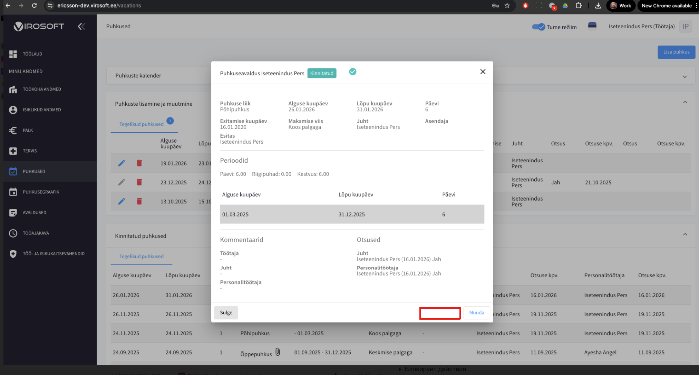
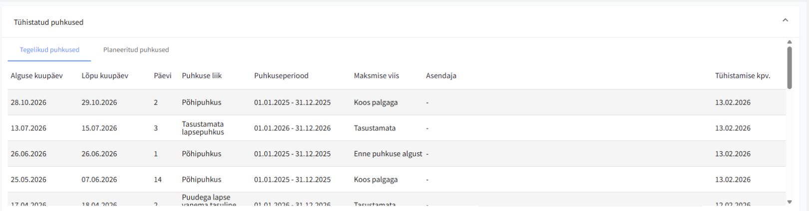

# 37: Отмена отпуска после подтверждения без круга подтверждений

# Business Value

Клиенту необходимо обеспечить **контроль и управляемость процесса отмены фактических отпусков**, минимизировать ошибки и злоупотребления, а также обеспечить соответствие внутренним HR-регламентам.

## Цель

Реализовать управляемый процесс удаления отпуска с использованием:

* настраиваемого бизнес-правила (с иерархией настроек),
* ролевой модели,
* временных ограничений,
* статусов,
* интеграции с Virosoft,
* email-уведомлений,
* полной локализации (EST / ENG / RUS).

---

# Анализ

## 1\. Настройки администратора (иерархия)

Страница:
`/admin/settings#vacation-settings`

### Основная настройка

**Alustamata puhkuse tühistamine pärast kinnitamist**

> Отмена не начатого отпуска после подтверждения

---

### Новая поднастройка (в рамках данной задачи)

**Puhkuse tühistamine ilma kinnitamiseta**

> Отмена отпуска без дополнительного подтверждения

Тип: boolean (вкл / выкл)
Уровень: поднастройка к **Alustamata puhkuse tühistamine pärast kinnitamist**

---

### Логика работы настроек

1. Поднастройка не может быть включена, если основная настройка выключена.
2. На первом этапе реализации:
    * при включении основной настройки
      **поднастройка автоматически включается**
    * отключение поднастройки невозможно
    * возможность управлять ими независимо будет реализована позже в тикете VIT-4905
3. В текущем релизе:
    * основная настройка фактически всегда включает поднастройку
    * отключить только поднастройку нельзя

Если основная настройка выключена — используется текущее поведение системы.

---

## 2\. Инициация отмены отпуска

Кнопка:
**Tühista / Cancel / Аннулировать**

### Общие условия

* Отменить можно любой отпуск до первого дня отпуска (не включительно), если соблюдены ограничения типа оплаты.
* При типе оплаты «заранее» применяется правило 14 дней.
* Пользователь **может, но не обязан** указать причину отмены.

### Роли, имеющие право инициировать отмену

* Работник
* Прямой руководитель
* Работник персонала (HR)

---

## 3\. Ограничение по типу оплаты «Заранее»

### Правило 14 дней (обязательно для всех ролей)

Если установлен тип оплаты **«заранее»**:

Отмена возможна **не позднее чем за 14 календарных дней до начала отпуска**.

Если осталось менее 14 дней:

* действие блокируется
* отображается сообщение (локализовано):

| EST | ENG | RUS |
| --- | --- | --- |
| Puhkuse alguseni on jäänud vähem kui 14 päeva, puhkuse tühistamiseks pöörduge payroll.estonia@ericsson.com. | There are less than 14 days remaining before the start of the leave; to cancel the leave, please contact payroll.estonia@ericsson.com. | До начала отпуска осталось менее 14 дней, для отмены отпуска обратитесь по адресу payroll.estonia@ericsson.com. |

---

## 4\. Подтверждение отмены

**Подтверждение не требуется** (если включена основная настройка).

### Email НЕ отправляется, если отпуск отменяет:

* Прямой руководитель
* Работник персонала (HR)

### Email отправляется, если отмену инициирует работник:

Получатель: прямой руководитель
Триггер: отправка запроса на отмену

---

## 5\. Интеграция с Virosoft

* Подтверждение не требуется
* Запрос в Virosoft отправляется сразу после сохранения
* Инициатор: сотрудник / руководитель / HR

### Поведение в системе

* Отпуск помечается как **soft-delete**
* Физическое удаление не выполняется
* Отпуск остается со статусом **Tühistatud / Canceled / Отменен**

---

## 6\. Статусы отпуска

### Изменение статуса

**Подтверждён → Отменен**

### Локализация статусов

| EST | ENG | RUS |
| --- | --- | --- |
| Tühistatud | Canceled | Отменен |

---

## 7\. Отображение запросов для прямого руководителя

Страница:
`/employee-vacations`

* Отображаются отпуска со статусом **Отменен**
* В фильтре по решению доступно значение: **Отменен**

---

## 8\. Отображение запросов для работника

Страница:
`/vacations`

* Раздел: **Отмененные отпуска**

---

## 9\. Email-уведомления

### 9.1 Отмена отпуска (инициирована работником)

Email отправляется прямому руководителю, указанному в заявлении на отпуск.

**Получатель:** прямой руководитель
**Триггер:** отправка запроса на удаление

### Subject

| EST | ENG | RUS |
| --- | --- | --- |
| Puhkuse tühistamise teade [firstName lastName] – [startDay – endDay] | Leave cancellation notification [firstName lastName] – [startDay – endDay] | Уведомление об отмене отпуска [firstName lastName] - [startDay - endDay] |

### Body

| EST | ENG | RUS |
| --- | --- | --- |
| Töötaja [firstName] [lastName], [personalNumber], [structureCode] tühistas oma puhkuseavalduse. Puhkuse liik: [type] Alguskuupäev: [startAt] Lõppkuupäev: [endAt] Päevade arv: [days] Tasustamise viis: [paymentType] Tühistamise põhjus: [reason] | Employee [firstName] [lastName], [personalNumber], [structureCode] has cancelled their leave request. Leave type: [type] Start date: [startAt] End date: [endAt] Number of days: [days] Payment type: [paymentType] Reason for cancellation: [reason] | Сотрудник [firstName] [lastName], [personalNumber], [structureCode] отменил заявление на отпуск. Тип отпуска: [type] Дата начала: [startAt] Дата окончания: [endAt] Количество дней: [days] Способ оплаты: [paymentType] Причина отмены: [reason] |

---

## Прототип

Добавить кнопку удаления на подтвержденный фактический отпуск

Раздел отмененные отпуска

## Acceptance Criteria

### 1\. Иерархия настроек

* [ ] В разделе `/admin/settings#vacation-settings` отображается основная настройка **Alustamata puhkuse tühistamine pärast kinnitamist**.
* [ ] Под основной настройкой отображается поднастройка **Puhkuse tühistamine ilma kinnitamiseta**.
* [ ] Поднастройка недоступна (disabled), если основная настройка выключена.
* [ ] При включении основной настройки поднастройка автоматически включается.
* [ ] В текущем релизе поднастройку нельзя отключить отдельно от основной.
* [ ] При выключенной основной настройке система работает по текущей (старой) логике.

---

### 2\. Отображение кнопки отмены

* [ ] На подтверждённом отпуске отображается кнопка **Tühista / Cancel / Аннулировать**, если включена основная настройка.
* [ ] Кнопка отображается для ролей:
    * [ ] Работник
    * [ ] Прямой руководитель
    * [ ] HR
* [ ] Кнопка не отображается, если отпуск уже начался.
* [ ] Кнопка не отображается, если основная настройка выключена.

---

### 3\. Общая логика отмены

* [ ] Отпуск можно отменить только до первого дня отпуска (не включительно).
* [ ] Пользователь может указать причину отмены.
* [ ] Причина отмены не является обязательным полем.
* [ ] После отмены отпуск получает статус **Tühistatud / Canceled / Отменен**.
* [ ] Отпуск помечается как soft-delete.
* [ ] Физическое удаление записи не выполняется.

---

### 4\. Правило 14 дней (тип оплаты «заранее»)

* [ ] Если выбран тип оплаты «заранее», система проверяет правило 14 календарных дней.
* [ ] Если до начала отпуска ≥ 14 дней — отмена разрешена.
* [ ] Если до начала отпуска \< 14 дней — отмена блокируется.
* [ ] При блокировке отображается корректное локализованное сообщение (EST / ENG / RUS).
* [ ] Проверка правила 14 дней применяется ко всем ролям.

---

### 5\. Интеграция с Virosoft

* [ ] При успешной отмене отпуск автоматически отправляется в Virosoft.
* [ ] Отправка выполняется без дополнительного подтверждения.
* [ ] Интеграция вызывается независимо от роли инициатора.

---

### 6\. Email-уведомления

#### 6.1 Если инициатор — работник

* [ ] Email отправляется прямому руководителю, указанному в заявлении.

Subject соответствует локализации (EST / ENG / RUS).

* Body содержит все параметры:
    * firstName
    * lastName
    * personalNumber
    * structureCode
    * type
    * startAt
    * endAt
    * days
    * paymentType
    * reason

#### 6.2 Если инициатор — руководитель или HR

* [ ] Email-уведомление не отправляется.

---

### 7\. Отображение для руководителя

* [ ] На странице `/employee-vacations` отображаются отпуска со статусом **Отменен**.
* [ ] В фильтре доступно значение **Отменен**.
* [ ] Отменённые отпуска корректно фильтруются.

---

### 8\. Отображение для сотрудника

* [ ] На странице `/vacations` отображается раздел **Отмененные отпуска**.
* [ ] Отменённые отпуска отображаются в отдельном списке.
* [ ] Статус отображается корректно в соответствии с локализацией.

---

### 9\. Локализация

* [ ] Статус **Tühistatud / Canceled / Отменен** отображается корректно для всех языков.
* [ ] Сообщение о правиле 14 дней локализовано.
* [ ] Email Subject и Body локализованы.
* [ ] UI-кнопки (Tühista / Cancel / Аннулировать) локализованы.

---
# Дополнтиельные комментарии

В идеале они хотят чтобы можно было в первый день отпуска тоже отменять отпуск (при выборе оплаты с зарплатой). Но если это добавляет много часов к разработке, сейчас не делаем, чтобы успеть к лайву.

User avatar
Polina
Commented 22 days ago
Также частично покрывает это запрос оннинен, но функционал немного отличается, надо обсудить https://issues.virosoft.ee/issue/VIT-4900/Kontrol-nad-izmenyaemymi-i-udalyaemymi-otpuskami

Т.к. Эриксон тоже изначально хотели через подтверждение руководителя, а теперь без. Нужно подумать над возможностью реализации, чтобы не пришлось делать совсем новую разработку.

Из задачи оннинен:

Как работник могу аннулировать подтвержденный отпуск, отпуск удаляется из Virosoft только после подтверждения прямым руководителем и работником персонала. В задаче эриксон нет необходимости в подтвердении руководителем. Возможно настройка могла бы заранее позволять выбирать нужен ли круг подтверждения или нет.

Необходимо указать причину аннулирования отпуска. Можно в принципе добавить и в этой задаче (эриксон), не играет такой большой роли.

User avatar
Polina
Commented 20 days ago
В идеале чтобы отпуск при оплате с зарплатой можно было бы отменять в первый день отпуска тоже. Для этого нужно изучить присылаются ли нам ошибки при отмене из вирософта, если отмена невозможна (например, график утвержден). Если нет, хорошо бы реализовать чтобы показывалась ошибка в отмене.

User avatar
Polina
Commented 19 days ago

Все-таки попросили не включительно, чтобы в первый день отпуска не нужно было отменять.
