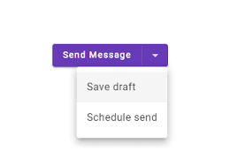
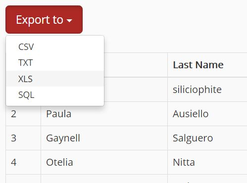

При скачивании заявления с **приложенными файлами** скачивается только само заявление в pdf.


**Ожидаемый результат:**

”При нажатии на кнопку скачать, скачивается архив с PDF и проложенными к заявлению файлами.”

Если у заявления нет приложенных файлов- заявление скачивается в формате pdf.


## **Описание задачи**

### 1\. Необходимо доработать функциональность скачивания заявления:

1. При нажатии на кнопку «Скачать»:
    * вместо немедленного скачивания отображается выбор варианта скачивания (dropdownl)
2. Пользователю доступны два варианта:
    * Скачать только заявление (PDF)
    * Скачать заявление с приложениями (ZIP-архив)
    * {width=251px}
3. Поведение:
    * При выборе PDF — скачивается текущий файл (как сейчас)
    * При выборе ZIP:
        * формируется архив, содержащий:
            * PDF заявления
            * все прикреплённые к заявлению файлы
        * архив скачивается пользователю
4. Требования:
    * Если у заявления **нет приложений**:
        * опция "с приложениями" не отображается **или** задизейблена
    * Название ZIP-файла:
        * `[ApplicationName]_[ID/Date].zip`
    * Внутри ZIP:
        * `application.pdf`
        * папка `attachments/` (если файлов несколько) или файлы в корне

---

### **Локализация (UI тексты)**

| ET | EN | RU |
| --- | --- | --- |
| Laadi alla | Download | Скачать |
| Ainult avaldus (PDF) | Application only (PDF) | Только заявление (PDF) |
| Avaldus koos lisadega (ZIP) | Application with attachments (ZIP) | Заявление с приложениями (ZIP) |

2\. **Исправление имени файла заявления**

#### **Текущее поведение:**

* Имя выглядит как:

  ```
  T%C3%B6%C3%B6lepingu-l%C3%B5petamise-aval...
  ```

  (URL-encoded, обрезанное, нечитаемое)

#### **Ожидаемое поведение:**

Имя файла должно быть:

```
[ApplicationType]_[EmployeeName]_[Date].pdf
```

#### **Примеры:**

* `Termination_John_Smith_2026-03-20.pdf`
* `Toolepingu_lopetamine_Mari_Maasikas_2026-03-20.pdf`

#### **Требования:**

* Без URL-encoding (%C3%…)
* Без спецсимволов
* Пробелы → `_`
* Дата в формате `YYYY-MM-DD`
* Аналогично для ZIP:

  ```
  Termination_John_Smith_2026-03-20.zip
  ```

---

### **3. Исправление генерации PDF**

#### **Проблема:**

* Добавляется пустая страница в конце

#### **Что нужно сделать:**

* Убрать лишний page break / пустой контейнер

#### **Ожидаемое поведение:**

* Если контент на 1 страницу → PDF содержит ровно 1 страницу
* Нет пустых страниц в конце

---

### **Acceptance Criteria (чек-лист)**

* [ ] При нажатии на кнопку «Скачать» больше не происходит мгновенное скачивание
* [ ] Открывается выбор варианта скачивания
* [ ] Доступны 2 опции: PDF и ZIP
* [ ] При выборе PDF скачивается только заявление
* [ ] При выборе ZIP скачивается архив с заявлением и файлами
* [ ] ZIP содержит:
    * [ ] PDF заявления
    * [ ] Все приложенные файлы
* [ ] Если приложений нет опция ZIP скрыта или disabled
* [ ] Все тексты локализованы на ET / EN / RU
* [ ] Название файлов соответствует заданному формату
* [ ] Решение работает во всех поддерживаемых браузерах
* [ ] Имя файла читаемое
* [ ] Нет URL-encoding
* [ ] Используется формат **`[Type]_[Name]_[Date]`**
* [ ] Пробелы заменены на **`_`**
* [ ] Формат даты **`YYYY-MM-DD`**
* [ ] Одинаковая логика для PDF и ZIP

---

### **PDF**

* [ ] Нет пустых страниц
* [ ] Количество страниц соответствует контенту
* [ ] Проверено на разных типах заявлений