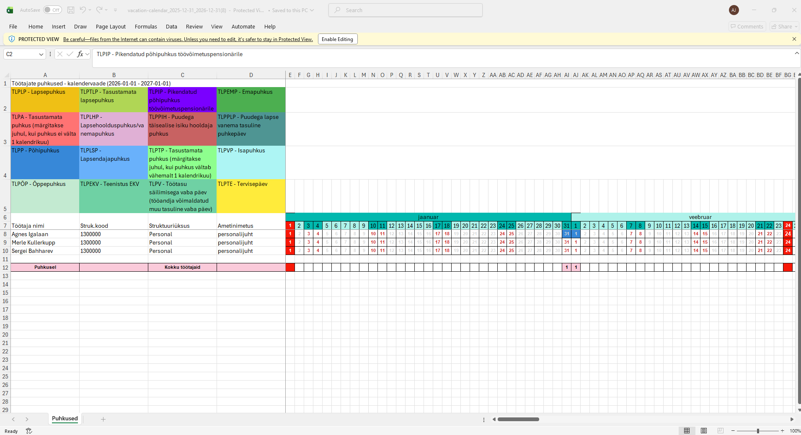
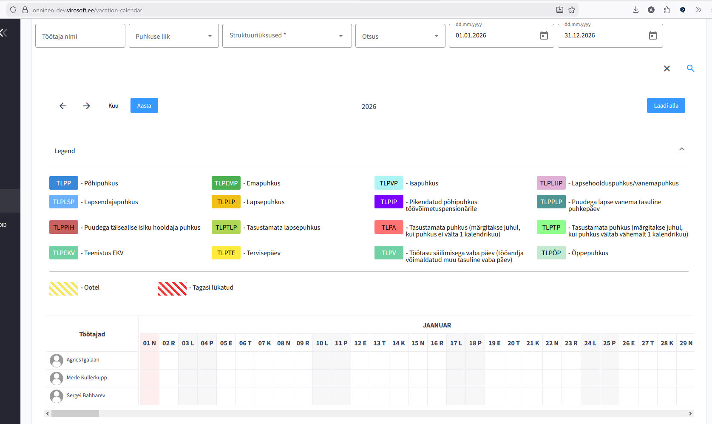
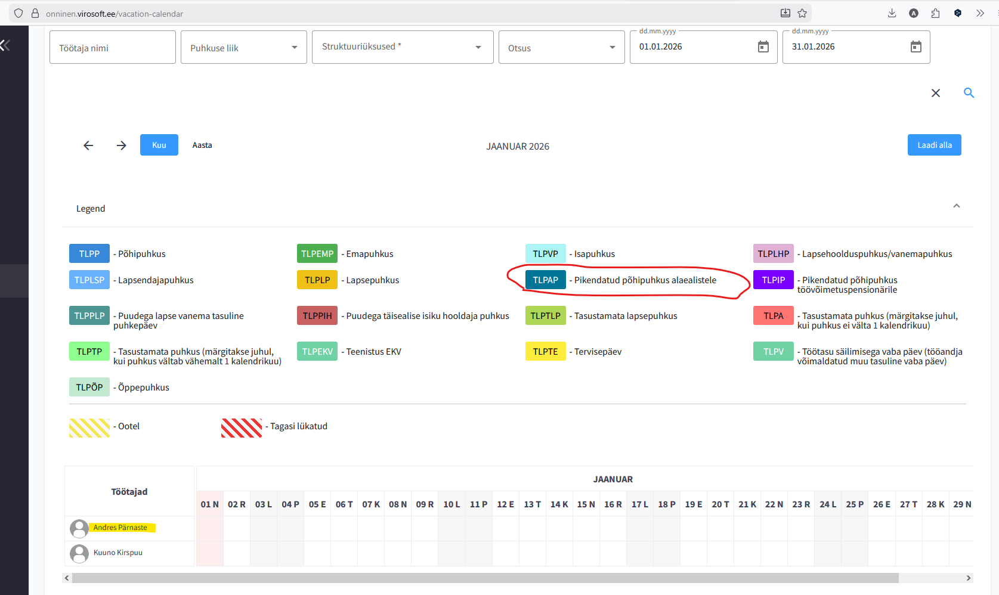
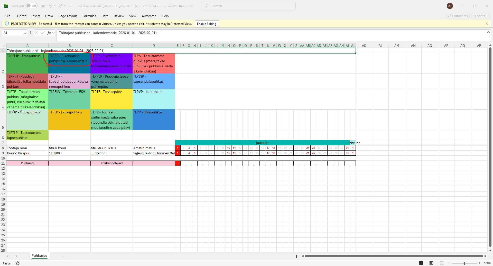

При скачивании файла Графика отпусков, если количество типов отпусков больше 16, то первый работник не отображается в графике.

**Пример:**

Onninen dev- 16 типов отпусков (помещаются в строчки 2-5), все работники отображаются в скачанном графике:

{width=261px}{width=247px}

Onninen prod- 17 типовы отпусков (помещаются в строчки 2-**6**), первый работник не отображается в скачанном графике:

{width=185px}{width=203px}

**Фактический результат:** При 17 типах отпусков легенда занимает дополнительную строку (строка 6), и первый работник из списка исчезает из файла (строка с его данными либо затирается, либо смещается/пропускается).

**Ожидаемый результат:**
В скачанном файле будут отображаться все работники независимо от количества типов отпусков.