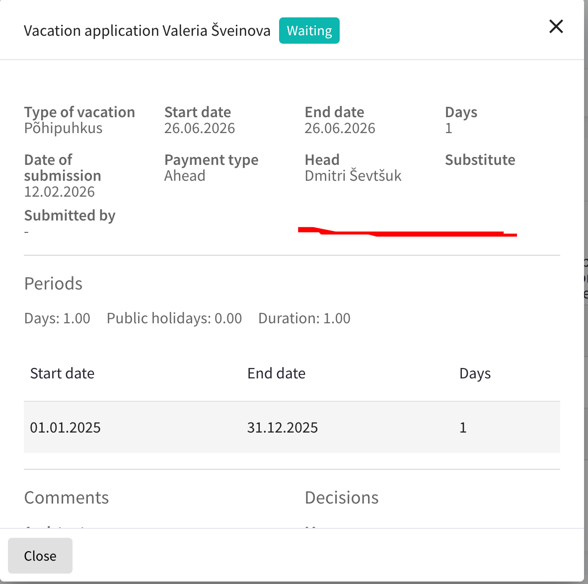

## Описание проблемы

Персональщик не видит остаток отпусков сотрудника при подтверждении заявления.

## Business Value

Позволяет принимать обоснованные решения и снижает риск ошибочного подтверждения.

## Описание задачи

Добавить отображение:

* общего остатка;
* запрашиваемых дней;
* остатка после подтверждения.

## Acceptance Criteria

* [ ] В интерфейсе подтверждения отображается актуальный остаток.
* [ ] Отображается количество запрашиваемых дней.
* [ ] Отображается остаток после подтверждения.
* [ ] Данные соответствуют расчётам системы.
* [ ] Отображение работает для всех типов отпусков.