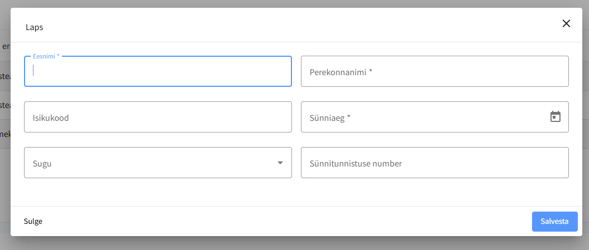
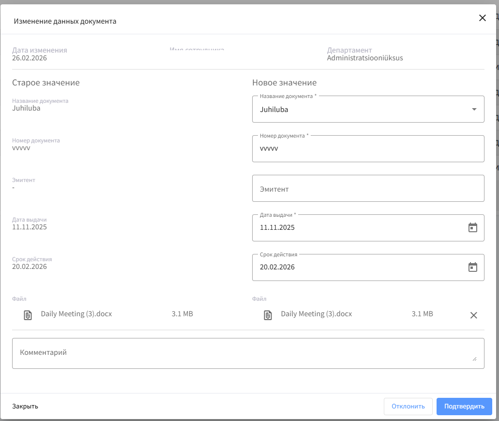

# Описание проблемы

В разделе «Дети» при добавлении ребенка отсутствует возможность прикрепить файл.
На данный момент документ нельзя загрузить ни при создании записи, ни при редактировании.

При этом в системе уже реализован процесс согласования изменений персональных данных (как в разделах «Документы» и «Образование»), включая:

* отправку данных на подтверждение персональщику,
* возможность редактирования данных персональщиком,
* подтверждение или отклонение с обязательным комментарием,
* уведомление сотрудника об отклонении.

Однако работа с файлом для раздела «Дети» в этом процессе отсутствует.

---

# Цель задачи

1. Добавить возможность загрузки и хранения файла при создании и редактировании записи о ребенке.
2. Интегрировать работу с файлом в существующий процесс подтверждения персональных данных (аналогично разделам «Документы» и «Образование»).

---

# Описание задачи

## 1\. Frontend (сторона сотрудника)

{width=70%}

{width=70%}

* Добавить поле загрузки файла в форму добавления ребенка.
* Добавить поле загрузки файла в форму редактирования ребенка.
* Отображать:
  * имя файла,
  * размер файла,
  * возможность удалить файл (до отправки на подтверждение).
* При сохранении запись отправляется на подтверждение персональщику (как сейчас).

---

## 2\. Backend

* Добавить поддержку хранения файла для сущности «Ребенок».
* Реализовать:
  * сохранение файла,
  * обновление файла,
  * удаление файла,
  * версионирование в рамках процесса согласования (если используется общий механизм).
* Интегрировать файл в существующую модель согласования персональных данных.

---

## 3\. Процесс подтверждения (сторона персональщика)

Реализовать поведение **аналогично разделу «Документы» и Образование** (использовать существующую логику как референс).

**При поступлении добавления ребенка:**

Персональщик должен иметь возможность:

* Просмотреть добавленные данные ребенка.
* Просмотреть прикрепленный сотрудником файл.
* Скачать прикрепленный сотрудником файл при клике.
* Удалить файл.
* Заменить файл на свой.
* Добавить файл, если сотрудник его не прикрепил.
* Изменить любые данные формы.
* Подтвердить добавление без изменений.
* Подтвердить добавлене с правками.
* Отклонить добавление.

**При поступлении изменения:**

Персональщик должен иметь возможность:

* все вышеперечисленное в добавлении
* \+ видеть старое значение при добавлении

{width=573px}

### При отклонении:

* Комментарий обязателен.
* Сотруднику отправляется уведомление (уже реализовано).
* В уведомлении отображается причина отклонения (уже реализовано).

---

## Важно

* Использовать существующую реализацию согласования из разделов:
  * «Документы»
  * «Образование»
* UI для персональщика должен быть консистентен с уже реализованным окном подтверждения.
* Поведение должно быть идентичным по логике.

---

## Acceptance Criteria

### Сотрудник

* [ ] В форме добавления ребенка есть поле загрузки файла
* [ ] В форме редактирования ребенка есть поле загрузки файла
* [ ] Можно прикрепить файл
* [ ] Можно заменить файл до отправки
* [ ] Можно удалить файл до отправки
* [ ] Файл отправляется на подтверждение вместе с данными

### Персональщик

* [ ] В окне подтверждения отображается файл
* [ ] Персональщик может скачать файл
* [ ] Персональщик может удалить файл
* [ ] Персональщик может добавить файл
* [ ] Персональщик может подтвердить без изменений
* [ ] Персональщик может подтвердить с изменениями
* [ ] При отклонении комментарий обязателен
* [ ] При отклонении сотруднику отправляется уведомление

### Backend

* [ ] Файл сохраняется вместе с записью ребенка
* [ ] Файл корректно обновляется
* [ ] Файл корректно удаляется
* [ ] Файл участвует в процессе согласования
* [ ] Логика идентична разделу «Документы»
* [ ] Регрессия существующего процесса согласования отсутствует