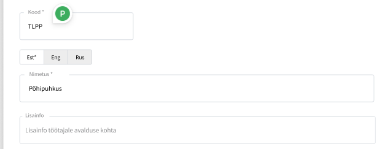

# Изменение названия и дополнительной информации по типу отпуска и локализация

# Текущее поведение

* Типы отпусков являются системными.
* Названия типов отпусков заданы системой и одинаковы для всех организаций.
* Название изменить нельзя.
* Код типа отпуска является системным идентификатором и используется во внутренней логике.
* Описание типа отпуска в системе отсутствует (не хранится и не отображается).

---

# Новое поведение

{width=770}

## Название типа отпускаoc

### Организация должна иметь возможность:

* изменить название типа отпуска;
* задать переводы названия на поддерживаемых языках.

Изменение выполняется на уровне организации (override).

При этом:

* код типа отпуска остаётся неизменяемым;
* системные названия сохраняются как базовые (дефолтные).

### Начальное состояние

* Все типы отпусков уже имеют системные названия и переводы (EST / ENG / RUS).
* При открытии детальной страницы отпуска администратор видит предзаполненные системные значения.
* Если организация не вносила изменений — используются системные значения.
* При первом редактировании создаётся override на уровне организации.
* EST обязателен для названия. Остальные языки нет (тогда используется EST)

## Описание типа отпуска (новая функциональность)

Необходимо реализовать возможность:

* добавлять описание типа отпуска;
* редактировать описание;
* удалять описание;
* хранить описание по языкам.
* Описание добавлять не обязательно

Описание создаётся и хранится на уровне организации.

Код типа отпуска остаётся неизменным и недоступным для редактирования.

# Локализация

Название и описание могут быть заданы на всех языках системы:

* EST
* ENG
* RUS

Правила:

* Заполнение всех языков не является обязательным.
* EST — обязательный язык **для названия.**
* Если для языка названия перевод отсутствует:
    * используется перевод EST.

---

# Ограничения

* Код типа отпуска редактировать нельзя.
* Максимальная длина названия — 100 символов.
* Максимальная длина описания — 1300 символов для каждого языка.
* Изменения одной организации не влияют на другие организации.
* Уже созданные заявления на отпуск не изменяются.
* Новые заявления используют актуальные значения

# Где используется информация

Название и описание отображаются:

* на форме подачи заявления на отпуск после выбора типа;
* в окне подтверждения / отклонения отпуска;
* в детальном просмотре заявления.

Информация отображается на языке интерфейса пользователя.

# Acceptance Criteria

* [ ] Организация может изменить название типа отпуска
* [ ] Организация может изменить описание типа отпуска
* [ ] Организация может добавить переводы названия типа отпуска
* [ ] Организация может добавить переводы описания типа отпуска
* [ ] При открытии страницы первый раз отображаются системные (дефолтные) названия и переводы
* [ ] Если организация не вносила изменений — используются системные значения
* [ ] При первом редактировании создаётся override на уровне организации
* [ ] Если перевод для выбранного языка **в названии** отсутствует — используется fallback на EST
* [ ] Если у организации нет override — используется системное значение
* [ ] Код типа отпуска остаётся неизменяемым
* [ ] EST обязателен для названия
* [ ] Названия и описания корректно отображаются на языке интерфейса пользователя
* [ ] Изменения одной организации не влияют на другие организации
* [ ] Уже созданные заявления на отпуск не изменяются
* [ ] Новые заявления используют актуальные значения
* [ ] *Реализовано логирование изменений*