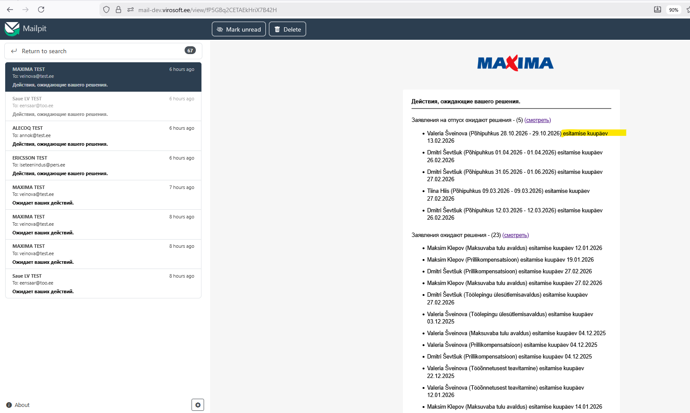

# Локализация [list] действий, ожидающих решения в консолидированном оповещении

Требуется добавить локализацию действий в списках в консолидированном оповещении по открытым задачам:

1. Заявления на отпуск

   EST: [firstName lastName] ([type] [startAt] – [endAt]), esitamise kuupäev [submittedAt]
   RUS: [firstName lastName] ([type] [startAt] – [endAt]), дата подачи [submittedAt]
   ENG: [firstName lastName] ([type] [startAt] – [endAt]), submission date [submittedAt]

2. Заявления

   EST: [firstName lastName] ([applicationName]), esitamise kuupäev [submittedAt]
   RUS: [firstName lastName] ([applicationName]), дата подачи [submittedAt]
   ENG: [firstName lastName] ([applicationName]), submission date [submittedAt]

3. Неподтвердённые данные

   EST: [firstName lastName] ([dataType]), muudatuse kuupäev [changedAt]
   RUS: [firstName lastName] ([dataType]), дата изменения [changedAt]
   ENG: [firstName lastName] ([dataType]), change date [changedAt]

4. Опросы

   EST: [surveyName] [firstName lastName] küsimustiku staatus [surveyStatus] vaata
   RUS: [surveyName] [firstName lastName] статус опросника [surveyStatus] смотреть
   ENG: [surveyName] [firstName lastName] survey status [surveyStatus] view

{width=341px}