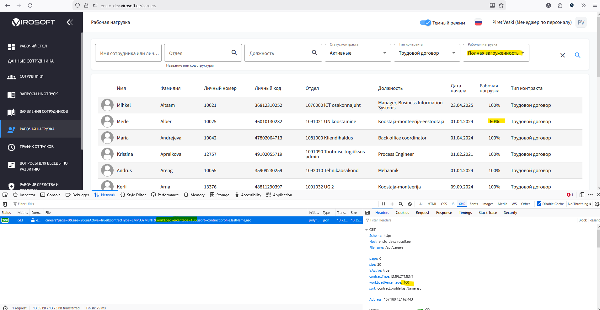

# Корректировка фильтра Нагрузка на странице /careers

**Описание проблемы:**

На странице /careers при выборе в фильтре "Нагрузка"- "Полная загруженность" (100%) также отображаются работники с частичной нагрузкой:

{width=265px}

**Ожидаемый результат:**

При выборе "Полная загруженность" в фильтре- отображаются работники только с "Рабочей нагрузкой" 100%.

