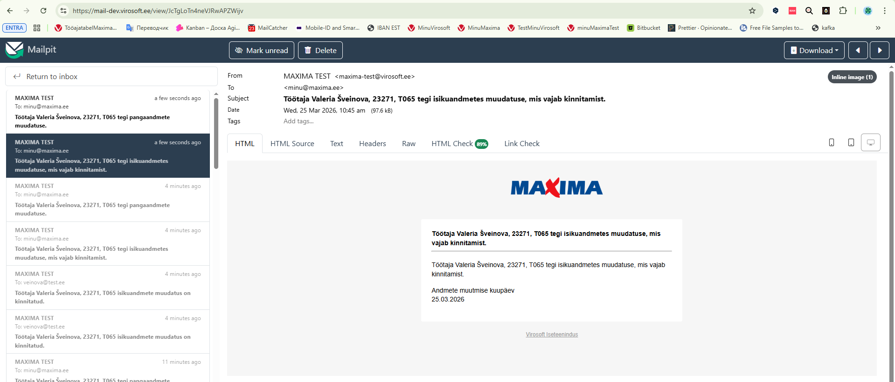

# Убрать лишнее оповещение при изменении расчётного счёта

**Описание проблемы:**

Сейчас при изменении Расчётного счёта также приходит лишнее оповещение об изменении личных данных:

{width=70%}

**Ожидаемый результат:**

Требуется, чтобы при изменении расчётного счёта приходило только одно оповещение, посвящённое изменению Расчётного счёта работника.
